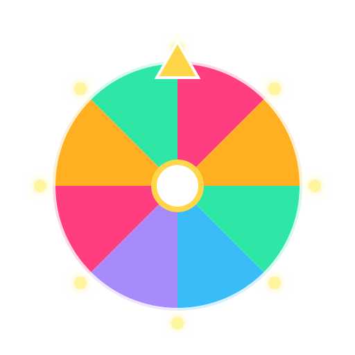
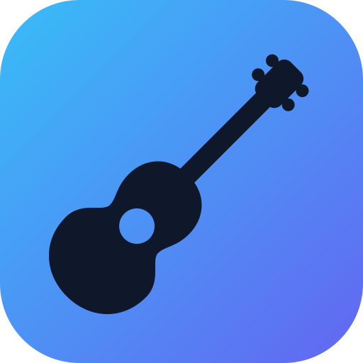
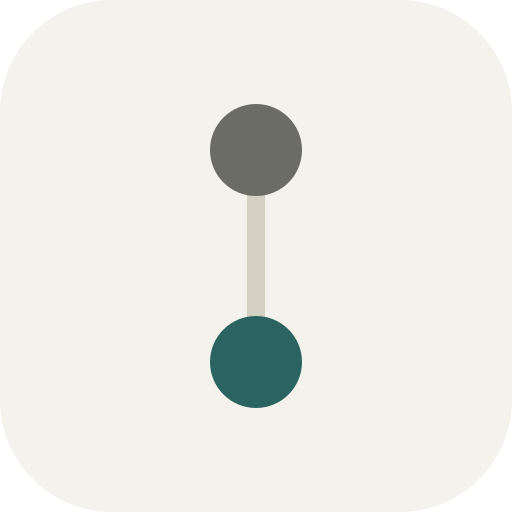
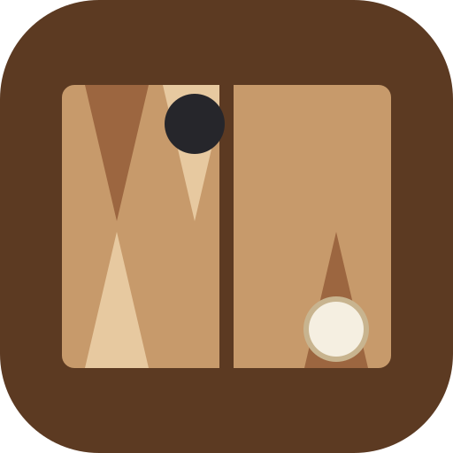
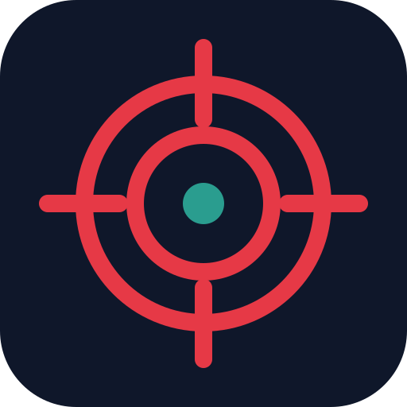
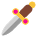
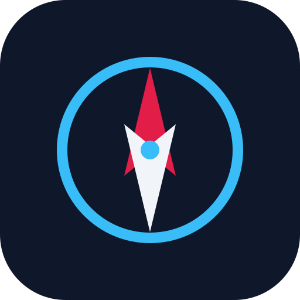
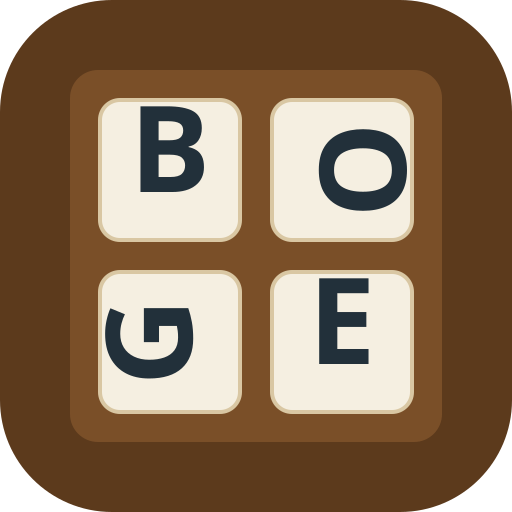
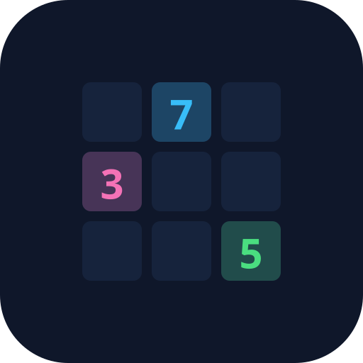

# Welcome to My Site

## Most popular
-  [Ideas Board](https://ideas-board-mu.vercel.app/)

## Apps

-  [Piano Practice](/piano-practice)
-  [RecipeBox](https://my-recipes-rho-rosy.vercel.app/)
-  [Petrol Prices](https://petrol-prices-nine.vercel.app/)
-  [Gardening Calendar](gardening-calendar)
-  [5-min Morning Yoga](morning-yoga)
-  [Game Timer](timer-app)
-  [Chore Wheel of Fortune!](https://chore-wheel-one.vercel.app/)
-  [GCSE Challenge](https://gcse-challenge.vercel.app/)
-  [Uke Box](https://uke-box.vercel.app/)
-  [First Twenty](first-twenty)

## Games
-  [Family Games](https://family-games-drab.vercel.app/)
-  [Family Game Rules](game-rules)
-  [Hunters](https://hunters-sigma.vercel.app/) - work in progress
-  [Traitors](traitors)
-  [Among Us](among-us)
-  [St Hilaire](https://st-hilaire.vercel.app)
-  [St Hilaire - monitor](https://st-hilaire.vercel.app/?view=monitor)
-  [Boggle](https://boggle-lovat.vercel.app/)
-  [Team Sudoku](https://team-sudoku.vercel.app/)

## Tutorials
-  [Vibe Coding instructions - web](vibe-coding-tutorial)
-  [Vibe Coding instructions with images - pdf](Vibe coding with prompts - Basics.pdf)
-  [Simple App Examples](vibe-coded-apps)

## Hockey

-  [Teamo](https://teamo-ruby-seven.vercel.app/)
-  [ISCA M4 App](isca-m4-hockey-app)
- [West Hockey League – Division 2 South](https://west.englandhockey.co.uk/competitions)

v1.1
